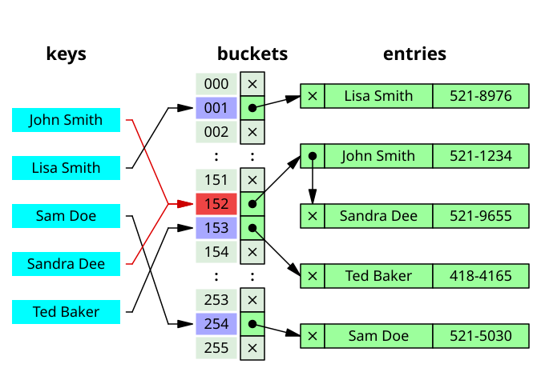
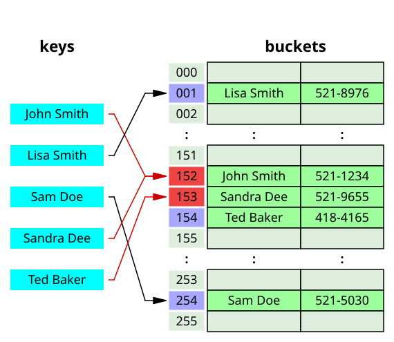

# Хэш-таблица
- [Хэш-таблица](#хэш-таблица)
  - [Задача](#задача)
  - [Хэш таблица как структура данных](#хэш-таблица-как-структура-данных)
  - [Конфигурация](#конфигурация)
  - [Изменение параметров программы](#изменение-параметров-программы)
  - [Анализ равномерности хэширования](#анализ-равномерности-хэширования)
  - [Оптимизации](#оптимизации)
    - [Оптимизация strncmp](#оптимизация-strncmp)
    - [Оптимизация list\_search](#оптимизация-list_search)
    - [Оптимизация CRC32 через SSE](#оптимизация-crc32-через-sse)
  - [Тестирование оптимизаций](#тестирование-оптимизаций)


## Задача

Написать базовую версию хэш-таблицы, после чего провести серию оптимизаций для повышения производительности операций добавления нового элемента и поиска. Цель (функция) для оптимизации выбиралась на основании профиля программы, полученного с помощью **perf** и его графической оболочки **hotspot**. Для тестирования хэш-таблицы был взят текст романа "Война и мир" Льва Николаевича Толстого на английском и отфильтрован: оставлены только слова (см. [преобразованный текст](text/War-and-Peace-processed.txt)). Для тестирования поиска отобрано около четверти слов (каждое четвертое слово)(см. [преобразованный текст](text/War-and-Peace-test.txt)). Необходимо сделать хотя бы 3 аппаратно зависимые оптимизации, причем должны присутствовать следующие:

- Переписывание функции на ассемблер
- Использование SSE
- Использование ассемблерных вставок в код программ на C

Оптимизации в данной работе стоит продолжать, пока прирост производительности очередного улучшения не будет ниже 3%.

## Хэш таблица как структура данных
Хэш таблица - структура данных, реализующая интерфейс ассоциативного массива, а именно, она позволяет хранить пары (ключ, значение) и выполнять три операции: добавление новой пары, удаление и поиск пары по ключу.
В данной задаче хэш-таблица - массив *H* списков пар.
Выполнение операции в хэш-таблице начинается с вычисления хэш-функции от ключа. Полученное хэш-значение играет роль индекса в массиве *H*.

Очевидно, ввиду ограниченности числа элементов в массиве *H* возможны коллизии - различные ключи, дающие одинаковые хэш-значения. Для разрешения коллизий существует несколько методов:
- открытая адресация: При использовании этого метода коллизия хешей разрешается с помощью пробного поиска или поиска по альтернативным местоположениям в массиве (по последовательности пробного поиска) до тех пор, пока не будет найдена либо целевая запись, либо неиспользуемый слот в массиве, что указывает на отсутствие такого ключа в таблице.
 [ссылка на википедию](https://en.wikipedia.org/wiki/Open_addressing)

 
- метод списков (используется в данной работе): Каждая ячейка массива *H* является указателем на связный список пар ключ-значение, соответствующих одному и тому же хеш-значению ключа. Коллизии просто приводят к тому, что появляются списки длиной более одного элемента.
 [ссылка на википедию](https://en.wikipedia.org/wiki/Hash_table)
 

 Хотя обычно для хэш-таблицы подбирается число *бакетов* (списков пар) примерно равным числу самих пар, чтобы поиск сводился лишь к вычислению хэш-функции, в данной работе, в целях расширения простора для оптимизации, число *бакетов* выбирается так, чтобы *load-фактор* (среднее количество пар на бакет) было около 10.

## Конфигурация

- **CPU**: AMD Ryzen 5 4600H with Radeon Graphics 3.00 GHz
- **OS**: Ubuntu 24.04.2 LTS (GNU/Linux 5.15.167.4-microsoft-standard-WSL2 x86_64)
- **Compiler**: g++ (Ubuntu 13.3.0-6ubuntu2~24.04) 13.3.0

## Изменение параметров программы

Изменение параметров хэш-таблицы, имен файлов для генерируемых графиков и файлов с входными данными: [params.cpp](src/params.cpp)

## Анализ равномерности хэширования

Перед началом внедрения оптимизаций стоит убедиться, что выбранная хэш-функция (**CRC32**) равномерно распределяет данные по хэш-таблице, таким образом поиск в различных бакетах будет занимать примерно одинаковое время.

Для исследования хэш-функции **CRC32** хэш-таблица полностью заполнялась с расчетом в среднем 10 записей на бакет, после чего рассчитывались следующие зависимости:

<details open>
<summary>Распределение по бакетам (размер)</summary>


</details>

<details open>
<summary>Распределение по размеру бакета</summary>


</details>

Из графиков делаем вывод, что функция хэширования хорошо подходит для хэш-таблицы - хэширование вполне однородное, с небольшим количеством выбросов, распределение по размеру нормальное с большей частью значений в диапазоне от 7 до 13 записей на бакет.

## Оптимизации

Сначала посмотрим на профиль программы базовой(начальной) версии:

<details open>
<summary>perf data</summary>


</details>

Хотя из данных о работе программы видно, что наиболее используемая функция - это list_search, в качестве первого шага оптимизации было решено выбрать целью вторую по времени работы strncmp.

### Оптимизация strncmp

Примем во внимание, что слова в нашем тексте занимают не более 16 символов каждое, поэтому можно проводить сравнение строк, используя SIMD инструкции с xmm регистрами.


<details open>
<summary>Код str16cmp</summary>

Код оптимизированной функции ([ссылка на исходник](src/my_optimized_funcs.cpp)):

```C
bool my_str16cmp(char word1[STRING_SIZE], char word2[STRING_SIZE]) {
    assert(word1);
    assert(word2);

    int mask;
    __asm__ volatile (
        "movdqu (%1),     %%xmm0 \n\t"    // xmm0 = word1
        "movdqu (%2),     %%xmm1 \n\t"    // xmm1 = word2
        "pcmpeqb  %%xmm1, %%xmm0 \n\t"    // xmm0 = cmpeq(xmm0, xmm1)
        "pmovmskb %%xmm0, %0 \n\t"        // mask = movemask(xmm0)
        : "=r"(mask)                      // Exit
        : "r"(word1), "r"(word2)          // Entry
        : "xmm0", "xmm1"                  // Dstr
    );

    return mask == 0xFFFF;
}

```

Эквивалент на C без ассемблерных вставок:

```C

bool my_str16cmp(char word1[STRING_SIZE], char word2[STRING_SIZE]) {
    assert(word1);
    assert(word2);

    __m128i word1_xmm = _mm_loadu_si128((__m128i*)word1);
    __m128i word2_xmm = _mm_loadu_si128((__m128i*)word2);

    __m128i cmp = _mm_cmpeq_epi8(word1_xmm, word2_xmm);

    int mask = _mm_movemask_epi8(cmp);

    return mask == 0xFFFF;
}
```
</details>

Результаты оптимизации strncmp в сравнении с базовой версией (обе компилировались с -O3):

| str16cmp  | Insert ticks   | Insert bench | Search ticks   | Search bench |
|-----------|----------------|--------------|----------------|--------------|
| -         |     2074638899 |  1.00        |      416368305 |  1.00        |
| +         |     1904905110 |  1.09        |      398713650 |  1.04        |

### Оптимизация list_search

Мы пропустили list_search и сначала взялись за strncmp, но list_search - самая нагруженная функция в программе. Оптимизируем её.

В данной оптимизации list_search была полностью переписана на ассемблер x86_64 (синтаксис *NASM*). Как программисту, мне было известно, что список заполняется последовательно, поэтому вместо передвижения в списке по указателям, я сделал линейный проход в памяти по элементам списка, что избавило процессор от многих операций работы с памятью.

<details open>
<summary>Код list_search на ассемблере</summary>


Структуры, использующиеся в list_search([ссылка на исходник](headers/my_list.h)):

```C

struct hashtable_elem_t {
    char   buffer[STRING_SIZE];
    size_t hash;
    size_t counter;
};

typedef hashtable_elem_t lst_data_t;
typedef int32_t lst_index_t;

struct list_t
{
    lst_data_t*  data;
    lst_index_t* next;
    lst_index_t* prev;

    lst_index_t free;
    lst_index_t capacity;
};
```
Непосредственно код ([ссылка на исходник](src/asm_funcs.asm)):
```asm
list_search_asm_opt:

        ; rdi = list_t* lst
        ; rsi = char key[STRING_SIZE]

        vmovdqu   xmm1, [rsi]             ; key for search

        mov     rcx, [rdi + 32]           ; rcx = list.free
        mov     rax, [rdi]                ; rax = list.data
        shl     rcx, 5                    ; rcx = rcx * sizeof(list.data[0])
        add     rcx, rax                  ; rcx = list.data[list.free]

.search_loop:
        ; rax - curr_elem_ptr
        ; rcx - last_elem_ptr
        cmp     rax, rcx
        ja     .return_null               ; if (curr_elem_ptr >= last_elem_ptr) { return NULL }

        vmovdqu   xmm0, [rax]             ; curr_elem_ptr -> buffer
        vpcmpeqb  xmm2, xmm0, xmm1
        vpmovmskb edx, xmm2

        cmp     edx, 0xFFFF
        je      .return

        add     rax, 32                   ; ++curr_elem_ptr
        jmp     .search_loop

.return_null:
        xor     eax, eax

.return:
        ret

```
</details>

Эффект от оптимизации (относительно базовой версии, скомпилированной с -O3):

| str16cmp | asm list_search | Insert ticks   | Insert bench | Search ticks   | Search bench |
|----------|-----------------|----------------|--------------|----------------|--------------|
| +        | -               |     1904905110 |  1.09        |      398713650 |  1.04        |
| +        | +               |     1330447440 |  1.56        |      257925030 |  1.61        |

### Оптимизация CRC32 через SSE

Чтобы определить следующую цель, посмотрим профиль программы с уже осуществленными оптимизации:

<details open>
<summary>perf data</summary>


</details>

Теперь на втором месте после переписанной на ассемблер list_search (обозначена ??? в окне hotspot) идет crc32.

В последней оптимизации пользусь тем, что длина слова в тексте не превышает 16 байт, crc32 заменяем на версию crc32_16, которая вычислет хэш с помощью двух использований интринсиков _mm_crc32_u64, вычисляющих хэш для 8 байт.


<details open>
<summary>Код crc32_16</summary>

[ссылка на исходник](src/hash_funcs.cpp)

```C
uint32_t crc32_16(const char data[16]) {
    uint32_t crc = 0xFFFFFFFF;

    uint64_t part1 = *(const uint64_t*)(data);
    crc = _mm_crc32_u64(crc, part1);

    uint64_t part2 = *(const uint64_t*)(data + 8);
    crc = _mm_crc32_u64(crc, part2);

    return crc ^ 0xFFFFFFFF;
}
```

</details>

Эффект от оптимизации (относительно базовой версии, скомпилированной с -O3):

| str16cmp | asm list_search | SIMD CRC32 | Insert ticks   | Insert bench | Search ticks   | Search bench |
|----------|-----------------|------------|----------------|--------------|----------------|--------------|
| +        | +               | -          |     1330447440 |  1.56        |      257925030 |  1.61        |
| +        | +               | +          |     1151781450 |  1.80        |      227050830 |  1.83        |

## Тестирование оптимизаций

Для подсчета производительности каждой версии сравнивалось время работы `100` циклов полного заполнения хэш-таблицы (версии insert) и поиска (версии search) через **rdtsc**. Для большей точности и воспроизводимости вычислений программа исполнялась на одном ядре (см. [pin_to_core](src/unit_testing.cpp)) в отсутвие других запущенных приложений (только VS Code).
Исходники тестов: [run_tests](src/unit_testing.cpp)

Увеличение скорости работы базовой версии при компиляции с -O3 вместо -O0:

|Flags | Insert ticks   | Insert bench | Search ticks   | Search bench |
|------|----------------|--------------|----------------|--------------|
| -O0  |     2682216089 |  1.00        |      526570710 |  1.00        |
| -O3  |     2074638899 |  1.30        |      416368305 |  1.26        |

Увеличение скорости работы программы по сравнению с базовой версией, скомпилированной с -O3:

| str16cmp | asm list_search | SIMD CRC32 | Insert ticks   | Insert bench | Search ticks   | Search bench |
|----------|-----------------|------------|----------------|--------------|----------------|--------------|
| -        | -               | -          |     2074638899 |  1.00        |      416368305 |  1.00        |
| +        | -               | -          |     1904905110 |  1.09        |      398713650 |  1.04        |
| +        | +               | -          |     1330447440 |  1.56        |      257925030 |  1.61        |
| +        | +               | +          |     1151781450 |  1.80        |      227050830 |  1.83        |


Также предлагается посчитать специальный коэффициент ускорения: ускорение / (количество ассемблерных строк) * 1000.

Было взято значение ускорения, равное (1.80 + 1.83) / 2 = ~1.81, как среднее для insert и search:

<p align="center">
  
</p>
