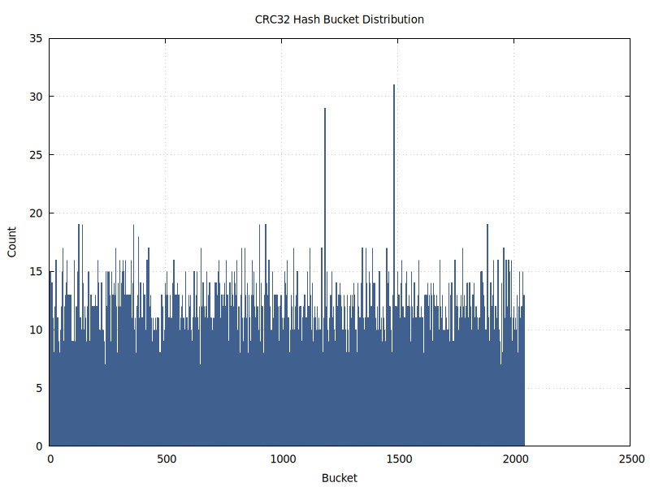
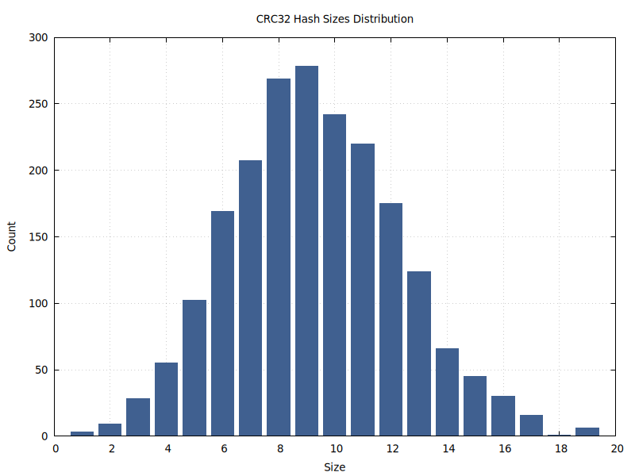

# Хэш-таблица
- [Хэш-таблица](#хэш-таблица)
  - [Задание по оптимизации](#задание-по-оптимизации)
  - [Теоретическая справка](#теоретическая-справка)
  - [Методология тестирования эффективности оптимизаций](#методология-тестирования-эффективности-оптимизаций)
  - [Изменение параметров программы](#изменение-параметров-программы)
  - [Анализ равномерности хэширования](#анализ-равномерности-хэширования)
  - [Оптимизации](#оптимизации)
    - [Оптимизация list\_search](#оптимизация-list_search)
    - [Оптимизация strncmp](#оптимизация-strncmp)
    - [Оптимизация CRC32 через SSE](#оптимизация-crc32-через-sse)
  - [Финальное сравнение](#финальное-сравнение)


Реализация хэш-таблицы со строками в качестве ключей как объект для ассемблерных оптимизаций операции вставки.

## Задание по оптимизации

Написать базовую версию хэш-таблицы, после чего провести серию оптимизаций для повышения производительности операции поиска. Цель (функция) для оптимизации выбирается на основании профиля программы, полученного с помощью **perf** и его графической оболочки **hotspot**. После чего необходимо сделать хотя бы 3 аппаратно-зависимые оптимизации, причем должны присутствовать следующие:

- Переписывание функции на ассемблер.
- Использование SSE.
- Использование ассемблерных вставок в код программ на C.

Оптимизации в данной работе стоит продолжать, пока прирост производительности очередного улучшения не будет ниже 3% (по указанию преподавателя).

## Теоретическая справка
Хэш таблица - структура данных, которая позволяет осуществлять доступ к элементу по его ключу. Соответствие между ключом и элементом при этом устанавливается хэш-функцией. Однако, ввиду ограниченности числа хэш-значений (множества значений хэш-функции) возможны `коллизии` - различные ключи, дающие одинаковые хэш-значения. Для разрешения коллизий существует несколько методов:

- **Открытая адресация**: Здесь хэш-таблица - массив пар ключ - значение, сначала с помощью хэш-функции определяется индекс в данном массиве, после чего начинается **пробирование** - поиск элемента или первой свободной ячейки в массиве по определенному для данной хэш-таблицы алгоритму. Квадратичное пробирование - один из наиболее распространенных алгоритмов. В нем шаг поиска растет как арифметическая прогрессия.


- **Метод цепочек** (используется в данной работе): В данной реализации хэш-таблица представляет собой массив списков пар ключ - значение. При появлении нескольких ключей с одинаковым хэш-значением они просто добавляются в один и тот же список.


 Хотя обычно для хэш-таблицы подбирается число *бакетов* (списков пар) примерно равным числу самих пар, чтобы поиск сводился лишь к вычислению хэш-функции, в данной работе, в целях расширения простора для оптимизации, число *бакетов* выбирается так, чтобы *load-фактор* (среднее количество пар на бакет) было около 10.


## Методология тестирования эффективности оптимизаций

Для тестирования был взят текст романа "Война и мир" Льва Николаевича Толстого на английском и отфильтрован: оставлены только слова (см. [преобразованный текст](text/War-and-Peace-processed.txt)). Для измерения времени операции поиска отобрано около четверти слов - примерно 100 000 (каждое четвертое слово)(см. [преобразованный текст](text/War-and-Peace-test.txt)).

Каждая из версий оптимизированной программы **100** раз выполняет поиск всех слов из входного файла (около 100 000), при этом измеряется время каждого отдельного поиска с помощью **rdtsc** - чтобы не учитывать время загрузки новой строки для поиска.

## Изменение параметров программы

Изменение параметров хэш-таблицы, имен файлов для генерируемых графиков и файлов с входными данными: [params.cpp](src/params.cpp).

## Анализ равномерности хэширования

Перед началом внедрения оптимизаций стоит убедиться, что выбранная хэш-функция (**CRC32**) равномерно распределяет данные по хэш-таблице, таким образом поиск в различных бакетах будет занимать примерно одинаковое время.

Для исследования хэш-функции **CRC32** хэш-таблица полностью заполнялась с расчетом в среднем 10 записей на бакет, после чего рассчитывались следующие зависимости:

<details open>
<summary>Распределение по бакетам (размер)</summary>



</details>

<details open>
<summary>Распределение по размеру бакета</summary>



</details>

Из графиков делаем вывод, что функция хэширования хорошо подходит для хэш-таблицы - хэширование вполне однородное, с небольшим количеством выбросов, распределение по размеру нормальное с большей частью значений в диапазоне от 7 до 13 записей на бакет.

## Оптимизации

Сначала посмотрим на профиль программы базовой(начальной) версии:

<details open>
<summary>perf data</summary>


</details>

Первая в очереди - list_search.

### Оптимизация list_search

В данной оптимизации list_search была полностью переписана на ассемблер x86_64 (синтаксис *NASM*). Как программисту, мне было известно, что список заполняется последовательно, поэтому вместо передвижения в списке по указателям, я сделал линейный проход в памяти по элементам списка, что избавило процессор от многих операций работы с памятью.

<details open>
<summary>Код list_search на ассемблере</summary>


Структуры, использующиеся в list_search([ссылка на исходник](headers/my_list.h)):

```C

struct hashtable_elem_t {
    char   buffer[STRING_SIZE];
    size_t hash;
    size_t counter;
};

typedef hashtable_elem_t lst_data_t;
typedef int32_t lst_index_t;

struct list_t
{
    lst_data_t*  data;
    lst_index_t* next;
    lst_index_t* prev;

    lst_index_t free;
    lst_index_t capacity;
};
```
Непосредственно код ([ссылка на исходник](src/asm_funcs.asm)):
```asm

list_search_asm:
        ; rdi = list_t* lst
        ; rsi = char key[STRING_SIZE] (STRING_SIZE=16)
        push    r12                      ; save callee-saved regs
        push    rbx

        mov     r12, rsi                 ; r12 = key

        mov     rcx, [rdi + 32]          ; rcx = list.free
        mov     rbx, [rdi]               ; rbx = list.data
        shl     rcx, 5                   ; rcx = rcx * sizeof(list.data[0])
        add     rcx, rbx                 ; rcx = list.data[list.free]

.search_loop:
        cmp     rbx, rcx
        jae     .return_null             ; if (curr >= end) return NULL

        ; prepare args for strncmp
        mov     rdi, rbx                 ; current elem
        mov     rsi, r12                 ; key
        mov     edx, 32                  ; comparison size
        call    strncmp

        test    eax, eax                 ; check match
        je      .return_found

        add     rbx, 64                  ; ++curr_elem_ptr (sizeof(lst_data_t) is 64 bytes)
        jmp     .search_loop

.return_found:
        mov     rax, rbx                 ; return pointer with matching string
        jmp     .cleanup

.return_null:
        xor     eax, eax                 ; return NULL

.cleanup:
        pop     rbx                      ; restore callee-saved regs
        pop     r12
        ret

```
</details>

Эффект от оптимизации (относительно базовой версии, скомпилированной с -O3):


| asm list_search | rdtsc тики      | Ускорение относительно версии без оптимизаций, скомпилированной с -O3 |
|-----------------|-----------------|--------------|
| -               |      5197108350 |  1.00        |
| +               |      2891587320 |  1.80        |

### Оптимизация strncmp


На втором месте после list_search по-прежнему идет strncmp (list_search обозначена как ??). Займемся ею.

Примем во внимание, что слова в нашем тексте занимают не более 16 символов каждое, поэтому можно проводить сравнение строк, используя SIMD инструкции с xmm регистрами.


<details open>
<summary>Код str16cmp</summary>

Код оптимизированной функции ([ссылка на исходник](src/my_optimized_funcs.cpp)):

```C
bool my_str32cmp(char word1[32], char word2[32]) {
    assert(word1);
    assert(word2);

    int mask = 0;
    __asm__ volatile (
        "vmovdqa (%1),     %%ymm0 \n\t"             // ymm0 = word1
        "vmovdqa (%2),     %%ymm1 \n\t"             // ymm1 = word2
        "vpcmpeqb  %%ymm1, %%ymm0, %%ymm0\n\t"      // ymm0 = cmpeq(ymm0, ymm1)
        "vpmovmskb %%ymm0, %0 \n\t"                 // mask = movemask(ymm0)
        : "=r"(mask)                                // Exit
        : "r"(word1), "r"(word2)                    // Entry
        : "ymm0", "ymm1"                            // Dstr
    );

    return mask == 0xFFFF;
}

```

Эквивалент на C без ассемблерных вставок:

```C

bool my_str32cmp(char word1[32], char word2[32]) {
    assert(word1);
    assert(word2);

    __m256i word1_ymm = _mm256_load_si256((__m256i*)word1);
    __m256i word2_ymm = _mm256_load_si256((__m256i*)word2);

    __m256i cmp = _mm256_cmpeq_epi8(word1_ymm, word2_ymm);

    int mask = _mm256_movemask_epi8(cmp);

    return mask == 0xFFFF;
}
```
</details>

Результаты оптимизации strncmp в сравнении с базовой версией (обе компилировались с -O3):

| asm list_search | str16cmp | rdtsc тики      | Ускорение относительно версии без оптимизаций, скомпилированной с -O3 |
|-----------------|----------|-----------------|--------------|
| +               | -        |      2891587320 |  1.80        |
| +               | +        |      2497043070 |  2.08        |


### Оптимизация CRC32 через SSE

Чтобы определить следующую цель, посмотрим профиль программы с уже осуществленными оптимизации:

<details open>
<summary>perf data</summary>


</details>

Теперь на втором месте после переписанной на ассемблер list_search (обозначена ??? в окне hotspot) идет crc32 (оптимизированная strncmp теперь заинлайнена вручную в list_search).

В последней оптимизации пользуясь тем, что длина слова в тексте не превышает 32 байт, crc32 заменяем на версию crc32_32, которая вычислет хэш с помощью нескольких использований интринсиков _mm_crc32_u64, вычисляющих хэш для 8 байт.


<details open>
<summary>Код crc32_32</summary>

[ссылка на исходник](src/hash_funcs.cpp)

```C
uint32_t crc32_32(const char data[32]) {
    uint32_t crc = 0xFFFFFFFF;

    uint64_t part1 = *(const uint64_t*)(data);
    crc = _mm_crc32_u64(crc, part1);

    uint64_t part2 = *(const uint64_t*)(data + 8);
    crc = _mm_crc32_u64(crc, part2);

    uint64_t part3 = *(const uint64_t*)(data + 16);
    crc = _mm_crc32_u64(crc, part3);

    uint64_t part4 = *(const uint64_t*)(data + 24);
    crc = _mm_crc32_u64(crc, part4);

    return crc ^ 0xFFFFFFFF;
}
```

</details>

Эффект от оптимизации (относительно базовой версии, скомпилированной с -O3):

| asm list_search | str16cmp | SIMD CRC32 | rdtsc тики      | Ускорение относительно версии без оптимизаций, скомпилированной с -O3 |
|-----------------|----------|------------|-----------------|--------------|
| +               | +        | -          |      2497043070 |  2.08        |
| +               | +        | +          |      2221201019 |  2.34        |

## Финальное сравнение

Увеличение скорости работы базовой версии при компиляции с -O3 вместо -O0:

|Flags | тики rdtsc     | Относительное ускорение |
|------|----------------|--------------|
| -O0  |      526570710 |  1.00        |
| -O3  |      416368305 |  1.26        |

Увеличение скорости работы программы по сравнению с базовой версией, скомпилированной с -O3:

| asm list_search | str16cmp | SIMD CRC32 | rdtsc тики      | Ускорение относительно версии без оптимизаций, скомпилированной с -O3 |
|-----------------|----------|------------|-----------------|--------------|
| -               | -        | -          |      5197108350 |  1.00        |
| +               | -        | -          |      2891587320 |  1.80        |
| +               | +        | -          |      2497043070 |  2.08        |
| +               | +        | +          |      2221201019 |  2.34        |


Также предлагается посчитать специальный коэффициент ускорения: ускорение / (количество ассемблерных строк) * 1000.


<p align="center">
  
</p>
